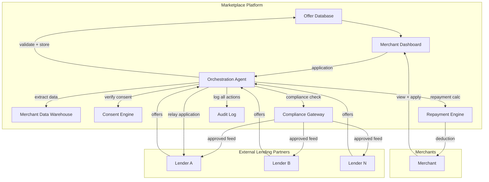

# Agentic orchestration for marketplace embedded lending — multi-party trust, fair-offer governance, and cross-organizational data-pipeline safety

> **SAFE‑AUCA industry reference guide**
>
> This use case describes a real-world agentic workflow for **marketplace embedded lending** — where a platform extracts merchant performance data, distributes it to external lending partners via automated pipelines, curates working-capital loan offers, facilitates merchant applications, and manages repayment through sales-proceeds deductions.
>
> It focuses on:
> - how the workflow works in practice (tools, data, trust boundaries, autonomy)
> - what can go wrong (defender-friendly kill chain)
> - how it maps to **SAFE‑MCP techniques**
> - what controls + tests make it safer
>
> **Defender-friendly only:** do **not** include operational exploit steps, payloads, or step-by-step attack instructions.  
> **No sensitive info:** do not include internal hostnames/endpoints, secrets, customer data, non-public incidents, or proprietary details.

---

## Metadata

| Field | Value |
|---|---|
| **SAFE Use Case ID** | `SAFE-UC-0032` |
| **Status** | `draft` |
| **NAICS 2022** | `52` (Finance and Insurance), `522390` (Other Activities Related to Credit Intermediation), `454110` (Electronic Shopping and Mail-Order Houses) |
| **Last updated** | `2026-02-16` |

### Evidence (public links)
- [CFPB — Innovation Spotlight: Marketplace Lending (public)](https://www.consumerfinance.gov/data-research/research-reports/innovation-spotlight-marketplace-lending/)
- [CFPB — Fair Lending and ECOA Compliance (public guidance)](https://www.consumerfinance.gov/compliance/supervisory-highlights/fair-lending/)
- [OCC — Third-Party Relationships: Risk Management Guidance (2023)](https://www.occ.gov/news-issuances/bulletins/2023/bulletin-2023-17.html)
- [Federal Reserve — Supervisory Guidance on Model Risk Management (SR 11-7)](https://www.federalreserve.gov/supervisionreg/srletters/sr1107.htm)
- [Bain & Company — Embedded Finance: $7 Trillion Opportunity (2022)](https://www.bain.com/insights/embedded-finance/)
- [European Commission — Digital Finance Strategy (2020)](https://finance.ec.europa.eu/publications/digital-finance-package_en)
- [BIS — Big Tech in Finance: Opportunities and Risks (2019)](https://www.bis.org/publ/arpdf/ar2019e3.htm)
- [Barocas, S. & Selbst, A.D. — Big Data's Disparate Impact, California Law Review (2016)](https://www.californialawreview.org/print/big-datas-disparate-impact/)

---

## Minimum viable write-up (Seed → Draft fast path)

If you're converting this into a stronger draft, aim to complete:
- Executive summary
- Industry context & constraints
- Workflow + scope
- Architecture (tools + trust boundaries + inputs)
- Operating modes
- Kill-chain table
- SAFE‑MCP mapping table (technique IDs may be `TBD` initially)
- Contributors + Version History (add your initial row)

---

## 1. Executive summary (what + why)

**What this workflow does**  
Large online marketplaces and platform businesses operate **embedded lending programs** where the platform acts as a data intermediary between merchants and external lending partners. The workflow involves:
- Extracting merchant performance signals (gross merchandise volume, return rates, daily cashflow, account health) from platform systems
- Distributing this data to partner lenders via scheduled pipelines (one-time historical backfill + daily incremental feeds)
- Receiving, storing, and presenting personalized working-capital offers from lenders to eligible merchants
- Facilitating merchant applications through an embedded origination journey on the platform
- Managing repayment by automatically deducting an agreed percentage of the merchant's net sale proceeds

An **agentic orchestration layer** can automate and optimize every stage of this pipeline: data extraction scheduling, feed quality monitoring, offer ranking and personalization, application pre-qualification, and repayment calculation. This is a high-value candidate for agentic automation because of the volume (millions of merchants), the real-time data flows, and the multi-party coordination required across organizational boundaries.

**Why it matters (business value)**  
Marketplace embedded lending is projected to exceed **$7 trillion globally by 2030** (Bain & Company). For platforms, it drives merchant retention, GMV growth, and revenue diversification. For merchants, it provides working capital without traditional bank friction. For lending partners, it provides pre-qualified deal flow with rich, real-time performance data they cannot obtain independently. Agentic automation can reduce pipeline latency from days to minutes, increase offer relevance, and improve capital deployment efficiency.

**Why it's risky / what can go wrong**  
This workflow creates an unusually complex threat surface because it introduces a class of safety challenges **fundamentally different from single-organization agentic systems:**
- **Multi-party trust asymmetry:** The agent operates across three distinct trust domains (platform, merchant, external lender) with conflicting incentives and no shared governance root — a topology that existing agentic safety frameworks do not model
- **Fair lending exposure:** Automated offer curation, ranking, or filtering by an AI agent creates de facto lending-decision participation, triggering Equal Credit Opportunity Act (ECOA), Truth in Lending Act (TILA), and state regulatory obligations even when the platform does not itself underwrite
- **Revenue-coupled financial harm:** Errors in repayment percentage calculation directly reduce merchant income — an autonomous miscalculation at scale constitutes a financial mass-harm event with no single-domain analogue
- **Cross-organizational data exfiltration surface:** Continuous, automated data feeds to external parties create a persistent exfiltration channel that, if manipulated, enables large-scale merchant data theft across organizational boundaries
- **Cascade risk across trust domains:** A corrupted data feed influences lender algorithms → which produce distorted offers → which merchants accept → creating compounding downstream harm that spans multiple organizations and is difficult to unwind

---

## 2. Industry context & constraints (reference-guide lens)

### Where this shows up
This pattern is common across:
- E-commerce marketplaces offering merchant working capital
- Payment processors and neobanks offering merchant cash advances
- Gig-economy platforms offering provider/driver financing
- B2B procurement platforms offering supply-chain finance
- Any platform with embedded Banking-as-a-Service (BaaS) integrations

### Typical systems
- **Merchant data platform:** GMV/revenue aggregation, return tracking, account-health scoring, daily cashflow computation
- **Data pipeline / ETL:** scheduled batch and streaming feeds to external lenders (SFTP, API, event bus)
- **Lender integration layer:** offer ingestion, status sync, application relay, disbursement confirmation
- **Offer management system:** storage, ranking, display logic, eligibility rules, A/B assignment
- **Merchant-facing UI:** offer presentation, application flow, repayment dashboard, terms display
- **Repayment engine:** sales-proceeds splitting, deduction calculation, reconciliation, remittance to lender
- **Identity & access:** merchant auth, lender API keys, internal RBAC, audit logging

### Constraints that matter
- **Regulatory:** ECOA (no discriminatory lending decisions), TILA (truth in lending disclosures), state lending licenses, GDPR/CCPA (data sharing consent), PSD2 (EU payment regulation), anti-money laundering (AML/KYC)
- **Fair lending:** Any automated system that influences which merchants see which offers, or how offers are ranked, is subject to disparate-impact analysis under federal and state law
- **Data minimization:** Only data necessary for lending decisions should be shared with each lender; over-sharing violates privacy principles and increases breach blast radius
- **Contractual:** Each lender partnership has specific data-sharing agreements, SLAs, and termination provisions
- **Operational:** Pipelines must meet daily SLAs; offer staleness harms merchant experience; repayment errors require immediate correction

### Must-not-fail outcomes
- Discriminatory offer presentation or filtering (fair lending violation)
- Incorrect repayment calculation reducing merchant revenue
- Unauthorized data sharing with lenders (privacy breach at organizational boundary)
- Manipulation of merchant data to inflate/deflate creditworthiness
- Merchant PII/financial data exfiltration through data pipeline compromise
- Regulatory penalties from non-compliant autonomous decisions

---

## 3. Workflow description & scope

### 3.1 Workflow steps (happy path)

**Phase 1: Data extraction & distribution**
1. Platform extracts merchant performance data (GMV, returns, cashflow, account age, dispute rate) from internal systems on a daily schedule
2. For new lender partnerships, a one-time historical backfill (typically 12 months) is generated and transmitted
3. Daily incremental data feeds are validated, anonymized where required, and transmitted to each partner lender via secured channels
4. Feed delivery is confirmed; anomalies (missing merchants, schema drift, volume spikes) are flagged

**Phase 2: Offer ingestion & management**
5. Lenders run proprietary risk models on received data and return personalized offer sets (amount, term, rate, repayment percentage)
6. Platform ingests offers, validates schema and business rules (e.g., maximum APR cap, minimum offer amount), and stores them
7. Offers are matched to merchants and made available in the merchant dashboard

**Phase 3: Merchant experience & application**
8. Eligible merchants see personalized working-capital offers on their dashboard
9. Merchant reviews terms, disclosures, and selects an offer
10. Application is relayed to the lender; lender performs final underwriting
11. Upon approval, funds are disbursed to the merchant's linked account

**Phase 4: Repayment**
12. A configured percentage of each sale's net proceeds is calculated and withheld as repayment
13. Withheld amounts are reconciled and remitted to the lender on a defined schedule
14. Merchant dashboard shows repayment progress, remaining balance, and projected payoff date
15. Upon full repayment, the deduction stops and the merchant becomes eligible for new offers

### 3.2 In scope / out of scope
- **In scope:** Agentic automation of data pipeline orchestration, feed quality monitoring, offer ingestion and validation, offer ranking/presentation, repayment calculation, and anomaly detection across the full lifecycle
- **Out of scope:** Lender-side risk modeling (proprietary to each lender); credit bureau interactions; collections and default management; actual funds movement (handled by payments infrastructure)

### 3.3 Assumptions
- The marketplace platform is the sole data intermediary between merchants and lenders
- Lenders do not have direct access to raw platform databases; all data flows through controlled pipelines
- Merchant consent for data sharing has been obtained and is revocable at any time
- The platform does not make credit decisions; it facilitates data flow and offer presentation
- Repayment deduction is governed by a legally binding agreement between merchant, lender, and platform

### 3.4 Success criteria
- Data feeds are delivered within SLA with <0.1% schema violation rate
- Offers displayed are current, accurate, and comply with all regulatory disclosures
- No disparate-impact bias detected in offer presentation or filtering
- Repayment calculations are accurate to the penny with full reconciliation audit trail
- All cross-organizational data transfers are logged, consent-verified, and anomaly-monitored
- Agent actions are attributable, reversible, and auditable at every stage

---

## 4. System & agent architecture

### 4.1 Actors and systems
- **Human roles:** merchant (loan recipient), lender relationship manager, platform risk/compliance team, platform engineering/data team, platform product team
- **Agent/orchestrator:** the agentic layer that can automate pipeline orchestration, offer management, and repayment workflows
- **Tools (MCP servers / APIs / connectors):** merchant data extraction APIs, lender feed APIs, offer management APIs, repayment engine APIs, compliance/audit APIs
- **Data stores:** merchant performance data warehouse, offer database, repayment ledger, audit log store, consent registry
- **Downstream systems affected:** merchant dashboard UI, lender integration endpoints, payment/settlement systems, compliance reporting systems, merchant communication channels (email/notification)

### 4.2 Trusted vs untrusted inputs (high value, keep simple)

| Input/source | Trusted? | Why | Typical failure/abuse pattern | Mitigation theme |
|---|---|---|---|---|
| Merchant transaction data (GMV, returns) | Semi-trusted | platform-derived but can be manipulated by fraudulent merchants | artificial inflation of GMV via shill transactions; manufactured return suppression | cross-validation + anomaly detection + fraud signals |
| Lender offer payloads | Semi-trusted | external party with contractual obligations | malformed offers; predatory terms; rate manipulation; schema poisoning | schema validation + policy enforcement + rate caps |
| Merchant application inputs | Untrusted | user-generated | misrepresentation; prompt injection in free-text fields; social engineering | input validation + isolation from agent instructions |
| Daily data feed contents | Semi-trusted | auto-generated from internal systems | data poisoning via upstream compromise; schema drift; stale data | checksums + row-count validation + freshness checks |
| Lender API responses (status, disbursement) | Semi-trusted | external system | false confirmation; replay attacks; status manipulation | cryptographic signatures + reconciliation + idempotency |
| Repayment calculation inputs (sale amounts) | Trusted (with verification) | platform payment system | rounding errors; currency conversion bugs; timing edge cases | deterministic calculation + dual-computation verification + reconciliation |
| Merchant consent records | Trusted | platform consent service | revoked consent not propagated; stale consent cache | event-driven consent checks + TTL on cached consent |

### 4.3 Trust boundaries (required)

This workflow has **five critical trust boundaries** — significantly more than typical single-organization agentic systems, and representing a novel multi-party trust topology:

**1. Platform ↔ External lender boundary**  
The most sensitive boundary. Merchant financial data crosses organizational lines. Auth: mutual TLS + API keys + IP allowlists. Logging: full request/response audit with data-classification tags. Risk: data exfiltration, unauthorized enrichment, feed manipulation.

**2. Platform ↔ Merchant boundary**  
Merchants interact with offers and repayment via the platform UI. Auth: merchant session + step-up for financial actions. Risk: misleading offer presentation, incorrect repayment display, consent manipulation.

**3. Agent ↔ Internal systems boundary**  
The agentic orchestrator accesses merchant data, offer stores, and repayment engines. Auth: scoped service accounts with least privilege. Risk: over-fetching, unauthorized aggregation, scope creep from read to write.

**4. Agent ↔ External lender APIs boundary**  
The agent may autonomously send data to or receive data from lenders. Auth: per-lender credentials with rate limits. Risk: agent sends data to wrong lender, agent accepts malformed offers, agent triggers unauthorized disbursement confirmations.

**5. Data pipeline ↔ Compliance boundary**  
Data feeds must pass through compliance checks (consent verification, data minimization, regulatory hold checks) before leaving the platform. Auth: compliance service acts as a policy gateway. Risk: bypassed compliance checks, stale consent, over-sharing.

### 4.4 High-level flow (illustrative)

### 4.5 Tool inventory (required)

| Tool / MCP server | Read / write? | Permissions | Typical inputs | Typical outputs | Failure modes |
|---|---|---|---|---|---|
| `merchant_data.extract` | read | scoped to merchant cohort + date range | merchant IDs, date range, metric set | merchant performance records | over-fetching; stale data; missing merchants |
| `consent.verify` | read | consent service | merchant ID, data-sharing purpose, lender ID | consent status (granted/revoked/expired) | stale cache; race condition with revocation |
| `compliance.check_feed` | read | compliance gateway | feed payload, destination lender, data classification | approve/reject + redaction instructions | false positive blocks; bypass if down |
| `lender_feed.transmit` | write | per-lender credentials | validated feed payload, lender endpoint | delivery confirmation + receipt hash | transmission failure; partial delivery; wrong recipient |
| `offer.ingest` | write | offer management service | lender offer payload | stored offer IDs | schema violation; duplicate offers; predatory-term detection miss |
| `offer.rank` | read/write | offer presentation service | merchant ID, eligible offers, ranking policy | ranked offer list | bias in ranking; stale offers; missing disclosures |
| `application.relay` | write | lender integration | merchant application, selected offer ID | application confirmation | double-submit; lender rejection; timeout |
| `repayment.calculate` | read/write | repayment engine | sale transaction, active loan terms | deduction amount, updated balance | rounding errors; currency edge cases; negative balance |
| `audit.log` | write (append-only) | audit service | action type, actor, payload hash, timestamp | log entry ID | log loss; tampering (if not immutable) |

### 4.6 Governance & authorization matrix

| Action category | Example actions | Allowed mode(s) | Approval required? | Required auth | Required logging/evidence |
|---|---|---|---|---|---|
| Read merchant data | Extract GMV, returns, cashflow for feed | HITL/autonomous | no (within scope) | service account + data classification | query logs + row counts |
| Verify consent | Check merchant data-sharing consent | autonomous | no | consent service token | consent check logs |
| Transmit data to lender | Send daily feed | HITL initially → autonomous (guarded) | yes (HITL) / automated (with compliance gate) | per-lender mTLS + API key | full payload hash + delivery receipt |
| Ingest offers | Store lender offers | autonomous (guarded) | no (schema validation is gate) | lender-authenticated payload | offer audit trail |
| Rank/present offers | Determine display order | autonomous (guarded) | no (policy rules are gate) | internal service | ranking rationale + bias metrics |
| Relay application | Submit merchant application to lender | HITL (merchant confirms) | yes (merchant consent) | merchant session + step-up | application audit trail |
| Calculate repayment | Compute deduction from sale proceeds | autonomous (deterministic) | no (deterministic rules) | repayment engine service | calculation log + reconciliation |
| Modify repayment terms | Change deduction percentage | manual only | always (compliance + legal) | multi-party approval | immutable change record |
| Override offer eligibility | Manually include/exclude merchant from offers | manual only | always (compliance review) | elevated role + rationale | override justification + audit |

### 4.7 Sensitive data & policy constraints
- **Data classes:** Merchant PII (name, address, bank details), merchant financial data (revenue, cashflow, returns — trade secrets), loan terms (contractually sensitive), repayment records (financial PII), lender proprietary model signals
- **Retention / logging constraints:** Financial records retention per jurisdiction (7 years typical); audit logs immutable and tamper-evident; merchant data must be purgeable on consent revocation (right to erasure)
- **Regulatory constraints:** ECOA (no discriminatory lending facilitation), TILA (truth in lending disclosures), GDPR/CCPA (data minimization, consent, portability, erasure), state lending laws, AML/KYC, PSD2 (EU)
- **Safety/consumer harm constraints:** Merchants must never be shown predatory offers; repayment must never exceed agreed percentage; merchants must be able to exit the program; no lock-in or coercive offer presentation

---

## 5. Operating modes & agentic flow variants

### 5.1 Manual baseline (no agent)
Today in many platforms, this workflow is partially manual:
- Data engineering teams maintain ETL pipelines with manual monitoring and incident response
- Offer ingestion involves manual schema mapping per new lender partnership
- Offer presentation follows static business rules with periodic manual tuning
- Repayment calculation is automated but parameter changes require manual deployment
- Compliance reviews are periodic rather than continuous

**Risks in manual mode:** Pipeline failures go undetected for hours; schema drift causes silent data corruption; offer staleness harms merchant experience; slow onboarding of new lenders; inconsistent compliance enforcement.

### 5.2 Human-in-the-loop (HITL / sub-autonomous)
The agent automates routine orchestration but requires human approval for:
- **First feed to a new lender** (data team reviews payload contents)
- **Offers exceeding policy thresholds** (APR caps, unusual terms)
- **Anomalous data patterns** (sudden GMV spikes/drops in feed data)
- **Merchant-facing changes** (new offer display formats, disclosure changes)
- **Repayment parameter changes** (any modification to deduction logic)

**Typical UX:** Agent surfaces anomalies and recommendations; human approves/rejects/modifies; agent executes approved actions.

**Risk profile:** Bounded by human review bandwidth; risk of approval fatigue at scale.

### 5.3 Fully autonomous (end-to-end agentic)
In fully autonomous mode, the agent:
- Monitors and self-heals data pipelines (retry, reroute, schema adaptation)
- Validates and ingests offers without human review (policy engine as gate)
- Ranks and presents offers using ML-driven personalization
- Pre-qualifies and routes applications autonomously
- Calculates and adjusts repayment deductions in real time
- Detects and responds to anomalies (circuit breakers, alerting, auto-rollback)

**Guardrails for autonomy:**
- **Hard limits:** Maximum feed size per transmission; APR and term caps on offers; repayment percentage ceiling
- **Circuit breakers:** Auto-halt on anomaly detection (>X% merchant data deviation, offer volume spike, repayment calculation mismatch)
- **Dual computation:** Repayment amounts calculated independently by two systems; mismatch triggers human review
- **Fairness monitoring:** Continuous disparate-impact analysis on offer presentation; demographic parity thresholds trigger alerts
- **Consent enforcement:** Real-time consent verification before every data transmission
- **Kill switch:** Instant pipeline halt accessible to compliance and engineering teams

**Blast radius if agent is wrong or manipulated:**
- Corrupted data feed → lenders make bad lending decisions → merchants receive inappropriate offers → regulatory exposure
- Manipulated offer ranking → disparate impact → fair lending violation → regulatory action + reputational harm
- Repayment miscalculation → incorrect deductions from thousands of merchants → mass financial harm + trust destruction
- Data exfiltration via pipeline → merchant financial data breach → privacy violations + class-action exposure

### 5.4 Variants

**Multi-agent architecture (recommended):**
1. **Pipeline Agent** — Owns data extraction, validation, transmission, and feed health monitoring
2. **Offer Agent** — Owns offer ingestion, validation, ranking, and presentation
3. **Application Agent** — Owns merchant application routing, status tracking, and disbursement confirmation
4. **Repayment Agent** — Owns deduction calculation, reconciliation, and balance management
5. **Compliance Agent** — Cross-cutting: monitors all other agents for policy violations, consent compliance, and fairness

**Batch vs real-time:**
- Historical backfill: batch (one-time, large payload)
- Daily feeds: scheduled batch (daily)
- Offer updates: near-real-time (event-driven)
- Repayment: real-time (per-transaction)
- Compliance monitoring: continuous streaming

---

## 6. Threat model overview (high-level)

### 6.1 Primary security & safety goals
- **Data integrity:** Merchant data feeds are accurate, complete, and untampered across organizational boundaries
- **Fair lending:** Offer curation and presentation do not create discriminatory outcomes
- **Financial accuracy:** Repayment calculations are correct to the penny at all times
- **Consent fidelity:** Data is only shared with lenders for whom the merchant has active consent
- **Confidentiality:** Merchant financial data is not leaked, over-shared, or aggregated beyond permitted scope
- **Auditability:** Every cross-boundary action is logged, attributable, and reconstructable

### 6.2 Threat actors (who might attack / misuse)
- **Fraudulent merchants:** Inflate GMV via shill transactions to obtain larger loan offers; manipulate data feeds indirectly
- **Compromised lending partner:** Exfiltrate merchant data beyond contractual scope; submit predatory offers; manipulate offer terms post-ingestion
- **Compromised lender API:** Return malformed offers containing injection payloads or manipulated terms
- **Insider (platform employee):** Modify pipeline to over-share data; manipulate offer ranking for specific merchants; alter repayment parameters
- **Compromised pipeline infrastructure:** Tamper with data in transit; redirect feeds to unauthorized endpoints
- **Adversarial ML attack:** If offer ranking uses ML, adversarial inputs could manipulate ranking to favor/disfavor specific merchant demographics

### 6.3 Attack surfaces
- **Data extraction layer:** Query manipulation, over-fetching, unauthorized aggregation
- **Lender feed transmission:** Man-in-the-middle, redirect, replay, unauthorized enrichment
- **Offer ingestion endpoint:** Schema poisoning, term manipulation, injection via offer metadata
- **Offer ranking/presentation logic:** Bias injection, fairness constraint bypass, A/B test manipulation
- **Merchant application flow:** Consent manipulation, double-submission, application replay
- **Repayment calculation engine:** Rounding manipulation, parameter injection, reconciliation bypass
- **Audit/logging system:** Log suppression, tampering, selective omission

### 6.4 High-impact failures (include industry harms)
- **Consumer/merchant harm:** Predatory offers shown to vulnerable merchants; incorrect repayment deductions reducing merchant revenue; discriminatory offer filtering; loss of merchant financial data
- **Business harm:** Regulatory penalties (ECOA/TILA violations — multi-million dollar fines); loss of lending partnerships; platform trust erosion; class-action litigation from merchants
- **Security harm:** Mass merchant data exfiltration via pipeline manipulation; unauthorized lender data access; integrity compromise of financial records; supply-chain attack via lender API compromise

---

## 7. Kill-chain analysis (stages → likely failure modes)

> Keep this defender-friendly. Describe patterns, not "how to do it."

| Stage | What can go wrong (pattern) | Likely impact | Notes / preconditions |
|---|---|---|---|
| 1. Entry / trigger | Adversary compromises data pipeline scheduling or lender API credentials | Enables data manipulation or unauthorized access | Requires infrastructure compromise or credential theft |
| 2. Data poisoning | Merchant data is manipulated before or during feed generation (e.g., inflated GMV, suppressed returns) | Lenders make lending decisions on false data; inappropriate offers generated | Fraudulent merchants or upstream system compromise |
| 3. Feed manipulation | Data feed is altered in transit or redirected to unauthorized recipient | Merchant financial data exfiltration; corrupted lender input | Pipeline infrastructure compromise |
| 4. Offer injection | Lender API returns manipulated offers (predatory terms, injection payloads in metadata fields) | Merchants shown harmful offers; agent behavior altered by injected content | Compromised lender or MITM on lender API |
| 5. Ranking/presentation bias | Offer ranking algorithm produces discriminatory outcomes (disparate impact by merchant demographic) | Fair lending violation; regulatory action; merchant harm | Latent bias in features or ranking model; adversarial manipulation of ranking inputs |
| 6. Consent bypass | Agent transmits data to lender without valid merchant consent or after consent revocation | Privacy violation; regulatory penalty; merchant trust breach | Stale consent cache; race condition in consent propagation |
| 7. Repayment manipulation | Repayment percentage or calculation is altered, deducting incorrect amounts from merchants | Direct financial harm to merchants at scale | Parameter injection; rounding exploit; reconciliation failure |
| 8. Persistence / feedback loop | Corrupted data or manipulated offers become embedded in historical records, influencing future lending cycles | Compounding errors over time; systemic bias entrenchment | Lack of data lineage; insufficient cross-cycle reconciliation |

---

## 8. SAFE‑MCP mapping (kill-chain → techniques → controls → tests)

> Goal: make SAFE‑MCP actionable in this workflow.

| Kill-chain stage | Failure/attack pattern (defender-friendly) | SAFE‑MCP technique(s) | Recommended controls (prevent/detect/recover) | Tests (how to validate) |
|---|---|---|---|---|
| Data poisoning | Manipulated merchant data in feed generation influences lender decisions across organizational boundary | SAFE‑T2105 (Disinformation Output); SAFE‑T1801 (Automated Data Harvesting) | Cross-validation of merchant metrics against independent signals; statistical anomaly detection on feed data distributions; merchant data integrity checksums | Inject synthetic anomalies into merchant data; verify detection and quarantine; compare feed outputs against known-good baselines |
| Feed manipulation / exfiltration | Data feed redirected, intercepted, or enriched beyond scope during cross-org transmission | SAFE‑T1910 (Covert Channel Exfiltration); SAFE‑T1911 (Parameter Exfiltration) | Mutual TLS + payload signing; feed content hashing with recipient verification; data minimization enforcement at compliance gateway; row-level consent tagging | Simulate feed redirect; verify detection; audit feed payload against data-sharing agreement scope; test with revoked-consent merchants in feed |
| Offer injection / schema poisoning | Lender returns offers with manipulated terms or injection payloads in metadata | SAFE‑T1102 (Prompt Injection); SAFE‑T1301 (Tool Schema Manipulation) | Strict schema validation on offer ingestion; policy enforcement (APR caps, term limits); treat offer metadata as untrusted data; isolate from agent instruction context | Fuzz offer payloads with boundary values and injection patterns; verify schema rejection; test policy enforcement on edge-case terms |
| Ranking / presentation bias | Offer ranking produces disparate impact across merchant demographics, violating fair-lending statutes | SAFE‑T2107 (Bias / Fairness Violation — *proposed for SAFE‑MCP catalog*) | Continuous fairness monitoring (demographic parity, equalized odds); ranking explainability; human review of ranking policy changes; A/B test governance with fairness constraints | Fairness audit on historical ranking decisions; synthetic merchant cohort tests for disparate impact; ranking explainability validation |
| Consent bypass | Agent shares data with lender without valid, current merchant consent | SAFE‑T1309 (Privileged Tool Invocation via Prompt Manipulation) | Real-time consent verification before every transmission; event-driven consent propagation (not cached); consent audit trail with immutable timestamps | Revoke consent for test merchant; verify next feed excludes them; test consent cache TTL and propagation latency |
| Repayment manipulation | Repayment calculation altered to deduct incorrect amounts from merchants at scale | SAFE‑T1404 (Response Tampering); SAFE‑T2105 (Disinformation Output) | Deterministic, auditable repayment calculation; dual-computation verification; reconciliation with independent ledger; percentage ceiling hard-coded and immutable | Inject edge-case transactions (micro-amounts, multi-currency, refunds); verify deduction accuracy; test reconciliation mismatch detection and alerting |
| Credential / scope escalation | Agent's service credentials used to access data or systems beyond intended scope | SAFE‑T1302 (Unauthorized Tool Invocation); SAFE‑T1309 (Privileged Tool Invocation) | Least-privilege service accounts per agent role; short-lived credentials; scope enforcement at API gateway; credential rotation on schedule and on suspicion | Attempt out-of-scope API calls with agent credentials; verify rejection; audit credential scope vs. actual usage patterns |
| Persistence / compounding | Corrupted data persists in historical records, compounding bias or errors in future lending cycles | SAFE‑T2105 (Disinformation Output) | Data lineage tracking; periodic reconciliation against independent sources; version-controlled feed history; anomaly detection on longitudinal trends | Introduce synthetic corruption in historical feed; verify detection in subsequent cycle; validate data lineage reconstruction |

**Notes**
- Technique **SAFE‑T2107 (Bias / Fairness Violation)** is proposed as a new technique for the SAFE‑MCP catalog — the intersection of agentic automation and fair-lending regulation creates a novel failure pattern not covered by existing techniques.
- Tests should use synthetic merchant data and mock lender endpoints; never use production merchant data in test environments.

---

## 9. Controls & mitigations (organized)

### 9.1 Prevent (reduce likelihood)
- **Multi-party trust boundary enforcement:** Separate service accounts, credentials, and network segments for each trust boundary (platform ↔ each lender, platform ↔ merchants, agent ↔ internal systems)
- **Data minimization at source:** Extract only the minimum merchant data fields required by each lender's agreement; enforce at the compliance gateway, not just in the agent
- **Real-time consent verification:** Check merchant consent immediately before every data transmission, with event-driven propagation of revocations (never rely solely on cached consent)
- **Strict schema validation:** All lender offer payloads validated against versioned schemas; reject and quarantine non-conforming offers
- **Policy-as-code for offer curation:** APR caps, term limits, and disclosure requirements encoded as enforceable policy rules, not agent heuristics
- **Deterministic repayment calculation:** Repayment computed by deterministic, auditable code with dual-computation verification — never by probabilistic model
- **Fair ranking constraints:** Offer ranking incorporates fairness constraints (demographic parity thresholds) as hard requirements, not soft objectives
- **Least privilege per agent role:** Each agent component (pipeline, offer, application, repayment) has scoped credentials with no cross-component access

### 9.2 Detect (reduce time-to-detect)
- **Feed anomaly detection:** Statistical monitoring on feed data distributions (merchant count, metric means/medians, schema compliance) with automated alerting on deviation beyond thresholds
- **Cross-lender reconciliation:** Compare offer volumes and terms across lenders for unusual patterns (e.g., one lender suddenly offering to 10x more merchants)
- **Fairness dashboards:** Continuous monitoring of offer presentation rates, approval rates, and terms across merchant demographics with alerting on threshold violations
- **Repayment reconciliation:** Independent reconciliation of deductions against repayment ledger and lender records on a daily basis
- **Consent audit:** Periodic comparison of data-sharing activity against consent records to detect any discrepancies
- **Behavioral analytics on agent actions:** Detect unusual patterns in agent behavior (e.g., accessing data outside normal schedule, querying unusual merchant cohorts, sending unexpected API calls to lenders)

### 9.3 Recover (reduce blast radius)
- **Pipeline kill switch:** Immediate halt of all data feeds to all or specific lenders, accessible to compliance and engineering
- **Offer quarantine:** Ability to quarantine and remove specific offer sets from merchant-facing UI within minutes
- **Repayment correction and merchant notification:** Automated correction of erroneous deductions with immediate merchant notification and refund processing
- **Feed recall protocol:** Contractual and technical mechanism to request lenders delete specific data feeds (e.g., if sent without consent or containing errors)
- **Rollback with data lineage:** Version-controlled feeds enable reconstruction of what data was sent when, to whom, supporting targeted remediation
- **Incident response playbooks:** Pre-defined playbooks for each failure mode (data breach, fair-lending violation, repayment error, consent violation) with regulatory notification timelines per jurisdiction

---

## 10. Validation & testing plan

### 10.1 What to test (minimum set)
- **Cross-organizational data boundary:** Agent cannot send merchant data to a lender without passing compliance gateway and consent verification
- **Offer validation:** Agent rejects offers that violate policy rules (APR caps, missing disclosures, schema violations)
- **Fair ranking:** Offer ranking does not produce disparate impact beyond defined thresholds
- **Repayment accuracy:** Deductions are correct across all edge cases (micro-transactions, refunds, multi-currency, rounding)
- **Consent enforcement:** Data feed excludes merchants who have revoked consent, including near-real-time revocations
- **Scope enforcement:** Each agent component cannot access data or tools beyond its assigned scope
- **Audit completeness:** Every cross-boundary action has a corresponding immutable audit log entry
- **Kill switch effectiveness:** Pipeline can be halted within target SLA (e.g., <5 minutes)

### 10.2 Test cases (make them concrete)

| Test name | Setup | Input / scenario | Expected outcome | Evidence produced |
|---|---|---|---|---|
| `consent_revocation_propagation` | Merchant with active consent and data in next feed batch | Merchant revokes consent 30 min before scheduled feed | Feed excludes merchant's data; consent audit log records revocation and exclusion | Feed diff + consent event log + audit trail |
| `offer_schema_poisoning` | Mock lender returns offer with malformed/injected metadata | Offer payload with boundary APR, injection in description field | Offer rejected by schema validator; quarantined; alert generated | Validation logs + quarantine record + alert |
| `fair_ranking_disparate_impact` | Synthetic merchant cohort with known demographic distribution | Run offer ranking on cohort | Ranking passes disparate-impact test (80% rule / statistical parity) | Fairness audit report + ranking rationale logs |
| `repayment_edge_cases` | Active loan with known terms | Micro-transaction ($0.01), refund, multi-currency sale, simultaneous transactions | Deduction calculated correctly; reconciliation passes | Calculation logs + reconciliation report |
| `pipeline_kill_switch` | Active daily feed in progress | Compliance team triggers kill switch | Feed transmission halts within SLA; partial delivery handled gracefully; lender notified | Kill-switch activation log + feed status + lender notification |
| `scope_escalation_attempt` | Agent component with scoped credentials | Attempt to access data or tools outside scope | API returns authorization error; attempt logged and alerted | Authorization denial log + security alert |
| `data_exfiltration_via_feed` | Agent attempts to include extra data fields not in lender agreement | Feed payload with additional columns beyond agreement scope | Compliance gateway strips unauthorized fields; alert generated | Gateway enforcement log + alert |
| `cross_lender_data_isolation` | Multiple active lender partnerships | Verify Lender A's feed does not contain Lender B's offer data or exclusive merchant segments | Clean separation confirmed; no cross-lender data leakage | Feed content audit per lender |

### 10.3 Operational monitoring (production)
- **Metrics:** Feed delivery success rate, offer ingestion volume, schema rejection rate, consent verification latency, repayment calculation accuracy, ranking fairness scores, agent action volume by type
- **Alerts:** Feed delivery failure, schema violation spike, consent check failure, repayment reconciliation mismatch, fairness threshold breach, unusual agent behavior pattern, kill switch activation
- **Runbooks:** Feed delivery failure recovery, offer quarantine procedure, repayment correction and merchant notification, consent violation response, fair-lending investigation protocol, data breach notification timeline (per jurisdiction)

---

## 11. Open questions & TODOs

- [ ] Confirm SAFE‑MCP technique IDs for all mappings; propose SAFE‑T2107 (Bias / Fairness Violation) as new technique for catalog
- [ ] Define formal fairness metrics and thresholds for offer ranking (demographic parity, equalized odds, calibration)
- [ ] Specify data minimization rules per lender partnership (which fields, at what granularity)
- [ ] Define repayment dual-computation architecture (which two systems calculate independently?)
- [ ] Establish feed recall protocol with lender partners (contractual + technical mechanism)
- [ ] Determine regulatory notification timelines per jurisdiction for each failure type
- [ ] Design agent behavioral analytics baseline (what constitutes "normal" agent behavior for anomaly detection?)
- [ ] Evaluate whether offer ranking should use ML or purely rule-based logic (ML introduces additional fairness and robustness challenges)
- [x] ~~Conduct systematic literature review on intersection of agentic AI safety and fair lending regulation~~ — **Completed.** Elicit.com review of 135 studies confirms all five novel contributions address documented literature gaps (see Appendix B and C)

---

## 12. Questionnaire prompts (for reviewers)

### Workflow realism
- Is the multi-party data flow (platform → lenders → offers → merchants) realistic for major marketplace lending programs?
- What integration patterns are we missing (e.g., lender-initiated data pulls vs. platform-push)?
- Are the repayment mechanics (percentage of net sale proceeds) accurately represented?

### Trust boundaries & permissions
- Are five trust boundaries sufficient, or are there additional boundaries (e.g., within the lender's own systems)?
- Is mutual TLS + API keys sufficient for the platform ↔ lender boundary, or should we model additional controls?
- How should agent credentials be managed across boundaries (short-lived tokens, vault, HSM)?

### Fair lending & regulatory
- Is the proposed fairness monitoring (demographic parity, equalized odds) sufficient for ECOA compliance?
- Should the agent be considered a "lending decision participant" even if the platform claims to only facilitate data flow?
- What happens when different jurisdictions have conflicting requirements (e.g., EU fair-lending vs. US ECOA)?

### Threat model completeness
- Are there threat actors we haven't considered (e.g., collusion between merchant and lender)?
- What is the highest-impact failure we haven't described?
- Should we model supply-chain attacks on the agent's own dependencies (LLM provider, cloud infrastructure)?

### Controls & tests
- Which controls are "must-have" vs "nice-to-have" for an initial deployment?
- Are the proposed tests sufficient to detect regressions in fairness and accuracy?
- Is a kill switch with <5 minute SLA achievable? What are the dependencies?

---

## Appendix

### A. Glossary
- **Embedded lending / embedded finance:** Financial services (loans, insurance, payments) integrated directly into a non-financial platform's user experience
- **Working capital:** Short-term financing used by businesses to fund day-to-day operations (inventory, payroll, expenses)
- **GMV (Gross Merchandise Volume):** Total value of goods sold through a marketplace
- **Net sale proceeds:** Sale revenue minus platform fees, returns, and applicable deductions
- **Revenue-based repayment:** Loan repayment mechanism where a fixed percentage of the borrower's revenue is deducted automatically until the loan is repaid
- **Disparate impact:** When a facially neutral policy or practice disproportionately affects a protected class, even without discriminatory intent
- **ECOA (Equal Credit Opportunity Act):** US federal law prohibiting discrimination in credit transactions
- **TILA (Truth in Lending Act):** US federal law requiring clear disclosure of loan terms and costs
- **Data minimization:** Principle of collecting and sharing only the minimum data necessary for a stated purpose
- **Compliance gateway:** A policy-enforcement point through which all cross-organizational data flows must pass
- **Dual computation:** Safety pattern where two independent systems calculate the same result; discrepancies trigger human review

### B. Novel contributions and research directions — grounded in systematic literature review

A systematic literature search was conducted using Elicit.com across 138 million academic papers (Semantic Scholar + OpenAlex). 500 papers were screened; 135 were included in the final synthesis. The review covered AI safety in embedded finance, algorithmic bias in lending, cross-organizational governance, data pipeline security, and revenue-based repayment risks.

**The review confirms that this use case addresses multiple documented gaps in the literature:**

#### Contribution 1: Multi-party trust boundary framework for agentic systems

**Literature evidence:** The Elicit synthesis rates cross-organizational governance evidence as **"Low to Moderate"** and identifies a persistent **"accountability gap"** — "undefined or unclear assignment of accountability remains a primary source of vulnerability in these complex systems" (Dobbe & Wolters, 2024). Existing work proposes federated governance models (Muthaiyah et al., 2024) and blockchain-based trust (Enyiorji, 2023; Kareem, 2025), but these address P2P lending or intra-banking collaboration — not the specific **platform ↔ merchant ↔ external lender** topology with continuous automated data feeds.

**Our contribution:** Formalizes trust boundaries across three distinct organizational entities with asymmetric information access and conflicting incentives. Extends agentic safety frameworks (OWASP, MITRE ATLAS, SAFE‑MCP) — which model single-org scenarios — to cross-organizational financial settings where data flows carry regulatory weight and cross five distinct trust boundaries simultaneously.

#### Contribution 2: Fair lending as a first-class agentic safety constraint

**Literature evidence:** The Elicit synthesis rates bias/fairness evidence as **"High"** with extensive literature on algorithmic bias in credit scoring (Hurlin et al., 2021; Blattner et al., 2021; Kumar et al., 2022; Langenbucher, 2020–2022; Dudik et al., 2020). However, this literature focuses exclusively on **credit scoring models making underwriting decisions** — not on **agentic systems curating, ranking, or filtering loan offers**. The Elicit synthesis also notes that "governance frameworks for multi-agent systems... are more nascent, with a greater reliance on conceptual proposals and early-stage prototypes."

**Our contribution:** Proposes that when an AI agent curates, ranks, or filters loan offers on a marketplace, it becomes a de facto participant in the lending decision — subject to ECOA, TILA, and state laws — even when the platform does not itself underwrite. This formalizes the boundary between "facilitating data flow" and "participating in a lending decision" in agentic contexts — a question not addressed in the existing fair-lending ML literature.

#### Contribution 3: Revenue-coupled financial safety — a new harm taxonomy

**Literature evidence:** The Elicit synthesis explicitly states: **"The included literature did not provide specific findings directly addressing the risks and safety concerns associated with revenue-based repayment (RBR) mechanisms."** The evidence strength is rated **"Very Low"** with the table showing "Not mentioned" across every extraction column. Out of 135 studies screened, **zero** address the unique risks of automated revenue-based repayment in the context of AI/agentic systems.

**Our contribution:** Identifies a novel risk class where an agent's error in one domain (repayment calculation) directly reduces revenue in another domain (marketplace commerce), creating cascading cross-domain financial harm with no analogue in single-domain agentic systems. This is the most strongly documented gap in the literature review.

#### Contribution 4: Cross-organizational data pipeline integrity for autonomous agents

**Literature evidence:** The Elicit synthesis rates data security evidence as **"Moderate"** and explicitly identifies that **"Security for cross-boundary data pipelines needs more empirical study."** Existing work addresses adversarial attacks on AI systems (Koshiya, 2025), zero-trust architectures for cross-bank collaboration (Dibouliya, 2025), and blockchain-based data lineage (Enyiorji, 2023) — but none model the specific attack surface of **autonomous agents managing continuous, daily data feeds to external organizations** in an embedded lending context.

**Our contribution:** Formalizes the security challenges of autonomous agents managing continuous data flows across organizational boundaries — a persistent exfiltration surface qualitatively different from the one-time API calls or federated model training addressed in existing literature.

#### Contribution 5: Proposed SAFE‑MCP technique — SAFE‑T2107 (Bias / Fairness Violation)

**Literature evidence:** No existing SAFE‑MCP technique covers discriminatory outcomes produced by agentic automation in regulated domains. The Elicit review confirms that while fairness metrics and mitigation strategies are well-studied for credit scoring models, the **application to agentic offer curation** in embedded lending is absent from the literature.

**Our contribution:** Proposes a new technique for the SAFE‑MCP catalog connecting agentic safety to decades of fair-lending jurisprudence and algorithmic fairness research, filling a gap in the current SAFE‑MCP technique taxonomy.

#### Summary of literature gap evidence

| Contribution | Elicit evidence strength | Gap documented? | Number of studies (of 135) addressing this specific gap |
|---|---|---|---|
| Multi-party trust boundaries for platform-lender-merchant topology | Low to Moderate | Yes — "accountability gap" | 0 (for this specific topology) |
| Fair lending for agentic offer curation (vs. credit scoring) | High (for credit scoring); gap for agentic | Yes — agentic governance is "nascent" | 0 (for agentic offer curation) |
| Revenue-coupled financial safety / RBR risks | Very Low | **Yes — explicitly: "not significantly addressed"** | **0** |
| Cross-org data pipeline integrity for autonomous agents | Moderate | Yes — "needs more empirical study" | 0 (for continuous automated agent-managed feeds) |
| Bias/Fairness as SAFE-MCP technique | N/A (framework contribution) | Yes — technique taxonomy gap | 0 |

### C. Systematic literature review methodology

The literature landscape was established via Elicit.com (systematic AI-assisted literature review platform):

- **Search scope:** 138 million academic papers (Semantic Scholar + OpenAlex)
- **Papers retrieved:** 500 most relevant to combined query
- **Papers screened:** 500 (abstract-level screening against 9 inclusion criteria)
- **Papers included in synthesis:** 135
- **Data extraction:** Structured extraction across 8 dimensions (AI safety mechanisms, bias risks, regulatory compliance, cross-org governance, data security, fairness mitigation, performance-safety tradeoffs, implementation challenges)
- **Date of review:** February 2026

**Combined search query used:**
> "How are AI agents or autonomous systems made safe in embedded finance or marketplace lending platforms? What are the risks of algorithmic bias and disparate impact in automated lending decisions under ECOA and fair lending regulation? How are trust boundaries managed when autonomous AI agents operate across multiple organizations with different governance? What are the security risks of automated data pipelines that share sensitive financial data across organizational boundaries? What are the risks and safety concerns of revenue-based repayment mechanisms in fintech and marketplace lending?"

### D. References

**Regulatory and industry references:**
- Bain & Company, "The Future of Fintech and Banking" (2023) — embedded finance market projections
- Consumer Financial Protection Bureau, "Innovation Spotlight: Marketplace Lending" (public)
- Office of the Comptroller of the Currency, "Third-Party Relationships: Risk Management Guidance" (2023)
- Federal Reserve, "Supervisory Guidance on Model Risk Management" (SR 11-7)
- European Commission, "Digital Finance Strategy" (2020)
- Bank for International Settlements, "Big Tech in Finance: Opportunities and Risks" (2019)

**Foundational fair-lending and algorithmic fairness (cited as established literature we extend):**
- Barocas, S. & Selbst, A.D., "Big Data's Disparate Impact," California Law Review (2016)
- Blattner, L., Nelson, S. & Spiess, J., "Unpacking the Black Box: Regulating Algorithmic Decisions," ACM EC (2021). https://doi.org/10.1145/3490486.3538379
- Hurlin, C., Pérignon, C. & Saurin, S., "The Fairness of Credit Scoring Models," SSRN (2021). https://doi.org/10.2139/ssrn.3785882
- Kumar, I.E., Hines, K.E. & Dickerson, J.P., "Equalizing Credit Opportunity in Algorithms: Aligning Algorithmic Fairness Research with U.S. Fair Lending Regulation," AAAI/ACM AIES (2022). https://doi.org/10.1145/3514094.3534154
- Langenbucher, K. & Corcoran, P., "Responsible AI Credit Scoring – A Lesson from Upstart.com," Digital Finance in Europe (2021). https://doi.org/10.1515/9783110749472-006
- Langenbucher, K., "Consumer Credit in The Age of AI – Beyond Anti-Discrimination Law," SSRN (2022). https://doi.org/10.2139/ssrn.4275723
- Dudik, M. et al., "Assessing and mitigating unfairness in credit models with the Fairlearn toolkit" (2020)
- Wu, J., "Algorithmic Fairness in Consumer Credit Underwriting: Towards a 'Harm-Based' Framework for AI Fair Lending," SSRN (2023). https://doi.org/10.2139/ssrn.4320444

**Multi-party governance and cross-organizational trust (closest existing work):**
- Muthaiyah, S. et al., "Orchestration of Federated Risk for P2P Lending Platforms: A Multi-Agent Systems (MAS) Approach," HighTech and Innovation Journal (2024). https://doi.org/10.28991/hij-2024-05-04-06
- Muthaiyah, S. et al., "Federated Risk-Based Access Control Model for P2P Lending Platforms," Emerging Science Journal (2024). https://doi.org/10.28991/esj-2024-08-06-05
- Dobbe, R. & Wolters, A., "Toward Sociotechnical AI: Mapping Vulnerabilities for Machine Learning in Context," Minds and Machines (2024). https://doi.org/10.1007/s11023-024-09668-y
- Gajula, S., "Federated Intelligence in Financial Ecosystems: A Privacy-Preserving AI Framework for Cross-Border Risk Analysis," JISEM (2025). https://doi.org/10.52783/jisem.v10i60s.13261

**Data security and cross-boundary pipeline integrity:**
- Koshiya, P.G., "Adversarial Threats In AI-RPA Financial Systems: Security Challenges And Defense Strategies," JICRCR (2025). https://doi.org/10.63278/jicrcr.vi.3285
- Dibouliya, A., "Zero-Trust Data Warehousing for Cross-Bank AI Collaboration: A Technical Review," JCSTS (2025). https://doi.org/10.32996/jcsts.2025.7.8.4
- Enyiorji, P., "Blockchain-enforced data lineage architectures with formal verification workflows enabling auditable AI decision chains," IJSRA (2023). https://doi.org/10.30574/ijsra.2023.9.2.0559
- Patil, A. et al., "Securing financial systems through data sovereignty: a systematic review," IJIS (2025). https://doi.org/10.1007/s10207-025-01074-4

**Agentic AI in finance (nascent literature):**
- Axelsen, H. et al., "Agentic AI for Financial Crime Compliance," arXiv (2025). https://doi.org/10.48550/arXiv.2509.13137
- Joshi, S., "Architectures and Challenges of AI Multi-Agent Frameworks for Financial Services," CJAST (2025). https://doi.org/10.9734/cjast/2025/v44i64558
- Nayak, P.S., "Agentic AI systems for autonomous financial decision-making," WJAETS (2025). https://doi.org/10.30574/wjaets.2025.14.3.0131
- Rizinski, M. & Trajanov, D., "AI Agents in Finance and Fintech: A Scientific Review," CMC (2025). https://doi.org/10.32604/cmc.2025.069678
- Borjigin, A. & He, C., "Safe and Compliant Cross-Market Trade Execution via Constrained RL and Zero-Knowledge Audits," arXiv (2025). https://doi.org/10.48550/arXiv.2510.04952
- Kareem, S.S., "FATE-Compliant ML Architecture with Blockchain-Verifiable Auditing: A Governance Framework for Ethical Compliance in FinTech," AAAI/ACM AIES (2025). https://doi.org/10.1609/aies.v8i3.36782

**AI harm taxonomies and safety frameworks:**
- Shelby, R. et al., "Sociotechnical Harms of Algorithmic Systems: Scoping a Taxonomy for Harm Reduction," AIES (2023)
- Sebastian, D., "Ethical Architecture in AI-Driven Credit: Balancing Inclusion, Fairness, and Transparency," JISEM (2025). https://doi.org/10.52783/jisem.v10i6s.13275
- Giudici, P. et al., "Artificial Intelligence risk measurement," Expert Systems with Applications (2023). https://doi.org/10.1016/j.eswa.2023.121220

---

## Contributors

- **Author:** (update with name/handle)
- **Reviewer(s):** TBD
- **Additional contributors:** TBD

---

## Version History

| Version | Date | Changes | Author |
|---|---|---|---|
| 1.0 | 2026-02-16 | Initial documentation of `SAFE-UC-0032` use case — Agentic orchestration for marketplace embedded lending; establishes multi-party trust boundary framework, fair-lending safety constraints, revenue-coupled financial safety model, and cross-organizational pipeline integrity analysis | (author) |
| 1.1 | 2026-02-16 | Added systematic literature review evidence (Elicit.com, 135 studies) to Appendix B; grounded all five novel contributions in documented literature gaps; expanded references with 30+ academic citations from the review | (author) |
